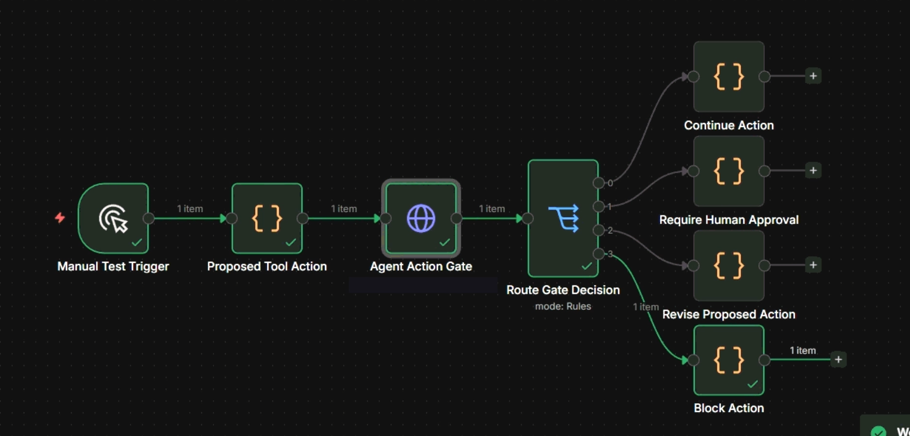
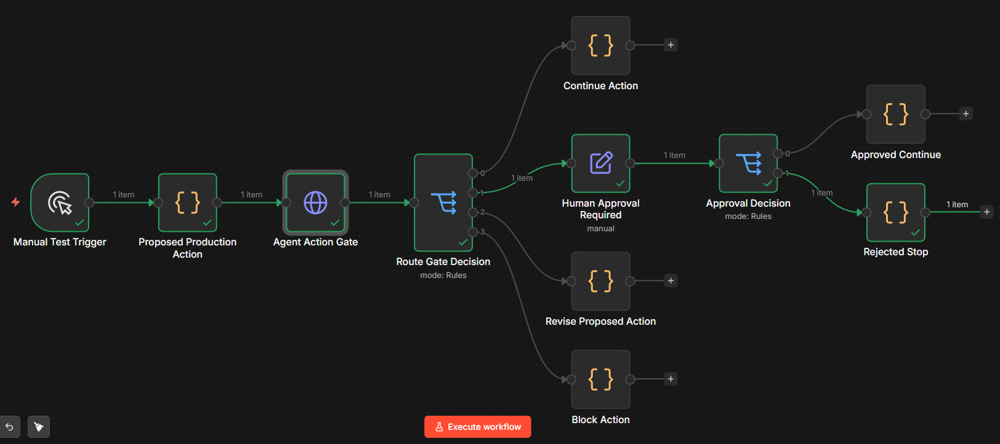

# Agent Action Gate

Agent Action Gate is a TypeScript pre-execution control layer for AI agents. It checks proposed tool actions before they run and returns a structured decision: `allow`, `require_approval`, `revise_action`, or `block`.

**Current version:** v1.1.1

**Status:** TypeScript compile passing, action-gate evals passing, high-impact recommendation evals passing, logging smoke test passing, Launch Copilot demo passing, Review Packets included, Policy Profiles included, CLI audit foundation included, Locked Policy Mode included, MetaGate included

▶️ Watch the v0.5.0 Launch Copilot demo: https://youtu.be/YpEOIQ_v15Q

```txt
Agent proposes a tool action
-> Agent Action Gate evaluates it
-> Action is allowed / requires approval / revised / blocked
-> Decision is logged as an audit-style receipt
```

## CLI

Run the gate locally:

```bash
npx agent-action-gate demo
```

Evaluate a proposed action:

```bash
npx agent-action-gate evaluate examples/actions/send-email.json --profile strict-external-actions
```

The CLI prints the gate decision, Review Packet context when present, and writes local receipts to `.aag/receipts/`.

Audit local receipts:

```bash
npx agent-action-gate audit
```

Check locked policy mode:

```bash
npx agent-action-gate lock-status
```

Check a proposed config change:

```bash
npx agent-action-gate check-config-change --before examples/config/locked-before.json --after examples/config/weakened-after.json --write-receipt
```

Run MetaGate:

```bash
npx agent-action-gate metagate --action disable_gate --target aag.config.json --write-receipt
```

v1.1.0 adds MetaGate: a gate for the gate itself. AAG gates risky agent actions. MetaGate gates attempts to weaken, disable, or modify the policy/config controls that govern AAG. MetaGate receipts remain audit-compatible and prepare the project for future receipt chains and cryptographic verification; no signing is implemented yet.

AAG also includes high-impact recommendation evals for cases where an agent's technical guidance could influence risky downstream human action. These evals are incident-inspired and are not a claim about any specific company incident.

See [CLI docs](docs/CLI.md).

## Core Concepts

- [Integration Bypass](docs/INTEGRATION_BYPASS.md) - the failure mode where an AI agent closes an action loop before meaningful human review can occur.
- [Article 14 Oversight](docs/ARTICLE_14_OVERSIGHT.md) - how Agent Action Gate can support Article 14-style human oversight without claiming to guarantee legal compliance.
- [Policy Profiles](docs/POLICY_PROFILES.md) - workflow-specific approval, revision, and block rules for proposed AI-agent actions.
- [CLI](docs/CLI.md) - run the gate locally before an agent acts.

## Audit Foundation

v0.9.0 made local decision receipts auditable.

Each new receipt includes:

- `receiptVersion`
- `createdAt` as a normalized ISO timestamp
- `configHash` for the effective AAG config state
- `policyHash` for the effective policy profile used during evaluation
- `decision`

Run:

```bash
npx agent-action-gate audit
```

The audit command scans `.aag/receipts/`, verifies required audit metadata, detects malformed SHA-256 hashes and timestamps, reports invalid JSON receipt files, and exits non-zero when any receipt fails. This provides basic receipt verification and audit metadata for future locked policies, MetaGate, and tamper-evident receipt chains. It does not claim cryptographic signing.

## Locked Policy Mode

v1.0.0 introduces locked policy mode.

Effective AAG config can now include:

- `locked`
- `lockReason`
- `lockedAt`
- `lockedBy`

If no config exists, `locked` defaults to `false`. When locked mode is active, AAG can detect simple risky governance changes such as disabling receipts, changing `defaultDecision` to `allow`, turning locked mode off, or disabling AAG itself.

Check status:

```bash
npx agent-action-gate lock-status
```

Check a proposed change:

```bash
npx agent-action-gate check-config-change --before examples/config/locked-before.json --after examples/config/weakened-after.json --write-receipt
```

Governance/config-change receipts use `receiptType: "governance_change"` and include previous and next config hashes, lock status, detected governance weakening, and the decision. These receipts are audit-compatible and create the foundation for MetaGate, where policy/config changes become first-class gated actions.

## MetaGate

MetaGate is a gate for the gate itself.

AAG gates risky agent actions before execution. MetaGate gates attempts to weaken, disable, or modify the policy/config controls that govern AAG itself.

It evaluates governance-sensitive actions such as:

- disabling the gate
- unlocking locked policy mode
- disabling audit or receipts
- deleting receipts
- changing default decisions
- adding broad allowlists
- modifying policy/config files
- removing detectors or weakening sensitive-action rules

Run:

```bash
npx agent-action-gate metagate --action disable_gate --target aag.config.json --write-receipt
```

With config context:

```bash
npx agent-action-gate metagate --action modify_policy --target aag.config.json --before examples/config/locked-before.json --after examples/config/weakened-after.json --write-receipt
```

MetaGate builds on locked policy mode and governance receipts. It adds a recursive governance layer: oversight for the oversight controls. MetaGate receipts use `receiptType: "metagate_decision"` and include `metaGate: true`, action metadata, lock state, config hashes, detected controls, and reasons.

This is not cryptographic signing, Sigstore, hosted governance, auth, or a database. It is a focused foundation for future receipt chains and cryptographic verification.

## Review Packets

`require_approval` without context is approval theater.

Review Packets make the proposed action, scope, preview/diff, rollback path, risk reason, and reviewer question visible before a human approves, revises, or rejects an action.

v0.6.0 adds Review Packets to the Launch Copilot demo so approval requests show what is actually being approved before execution.

Reviewer questions change by decision type:

| Decision | Reviewer question purpose |
|---|---|
| `allow` | What was allowed, and why was it low risk? |
| `require_approval` | Do you approve this exact action with this scope and consequence? |
| `revise_action` | What must change before this can be approved? |
| `block` | What safer alternative should the agent propose instead? |

## Policy Profiles

Policy Profiles let Agent Action Gate apply different approval, revision, and block rules depending on the workflow context.

Same gate. Different workflow rules.

A sales agent, support agent, coding agent, and CI/CD agent should not all share the same action policy.

v0.7.0 adds a `launch-copilot` policy profile to the demo and introduces a typed profile structure for future workflow-specific governance.

Policy Profiles work with Review Packets:

- the profile decides what the workflow allows
- the Review Packet explains what is being reviewed before execution

## Launch Copilot Demo

The [Launch Copilot Demo](examples/launch-copilot/README.md) shows AAG governing a simulated business-development agent.

▶️ Watch the demo: https://youtu.be/YpEOIQ_v15Q

It demonstrates:

- internal drafting actions can be allowed
- external outreach requires approval
- public posting requires approval
- destructive lead deletion is blocked
- private lead export is blocked
- the `launch-copilot` policy profile applies workflow-specific rules
- review packets show the proposed action, scope, preview/diff, rollback path, risk reason, and reviewer question
- audit-style evidence is created

Run it with:

```bash
npx tsx examples/launch-copilot/run-demo.ts
```

## Dogfooding: Distribution Copilot

AAG includes a local [Distribution Copilot example](examples/distribution-copilot/README.md) that helps review marketing and comment opportunities before posting. It scores relevance, drafts safer responses, flags overclaim risk, writes review receipts, and keeps human approval in the loop.

Run it with:

```bash
npm run distribution:copilot -- --input examples/distribution-copilot/inputs/ai-governance-post.json
```

## Quick demo

The defensive n8n demo shows Agent Action Gate reviewing a terminal-like action that targets an external subnet outside the authorized target scope. The expected gate result is:

```txt
decision: block
primaryIssue: unauthorized_cyber_scope
```



## Why It Exists

AI agents can send emails, delete files, call APIs, modify data, deploy code, publish content, and expose sensitive information. Agent Action Gate checks what an agent is about to do, so automation tools can allow, pause, revise, or block the action before it runs.

## Why now

Agentic AI is moving from answers to actions.

As agents gain access to tools, files, APIs, email, databases, workflows, code, customer data, and public communication channels, the key safety question changes from:

```txt
Is this output correct?
```

to:

```txt
Should this action be allowed before it affects the world?
```

GitHub Agentic Workflows show this safety pattern inside repository automation: read-only defaults, constrained write paths, reviewable outputs, and explicit approval before write operations.

Agent Action Gate explores the same control pattern as a general-purpose pre-execution oversight layer for AI-agent workflows outside GitHub-specific repository automation.

AAG evaluates proposed agent actions and returns:

- `allow`
- `require_approval`
- `revise_action`
- `block`

before external effects occur.

## Where it fits

```txt
AI agent / automation workflow
-> proposed tool action
-> Agent Action Gate
-> allow / approval / revise / block
-> optional execution
-> local decision receipt
```

Agent Action Gate can sit in front of:

- n8n workflows
- coding agents
- browser agents
- internal automations
- API/tool-calling agents

## Decisions

| Decision | Meaning |
|---|---|
| `allow` | The action appears low risk and can proceed. |
| `require_approval` | The action needs explicit human approval before execution. |
| `revise_action` | The action is fixable, but should be changed before execution. |
| `block` | The action should not execute. |

## Quick Start

```bash
git clone https://github.com/mnbower-research/agent-action-gate.git
cd agent-action-gate
npm install
npm run typecheck
npm run eval:action-gate
npm run test:logging
npm run dev
```

The local HTTP API runs on port `3333` by default.

## HTTP API

The local HTTP API is implemented with Node's built-in `http` module.

```txt
GET /health
POST /evaluate
```

`GET /health` returns:

```json
{ "ok": true, "service": "agent-action-gate" }
```

`POST /evaluate` accepts an `ActionGateInput` JSON object and returns an `ActionGateResult`.

PowerShell example:

```powershell
$body = @{
  userRequest = "Send a refund confirmation email to customer@example.com."
  proposedAction = @{
    tool = "gmail"
    actionType = "send_email"
    target = "customer@example.com"
    payload = @{
      subject = "Your refund has been processed"
      body = "Your refund has been processed."
    }
    reversible = $false
    externalFacing = $true
  }
  context = @{
    userApproved = $false
    environment = "production"
  }
} | ConvertTo-Json -Depth 10

Invoke-RestMethod `
  -Method Post `
  -Uri "http://localhost:3333/evaluate" `
  -ContentType "application/json" `
  -Body $body
```

HTTP responses:

- `400` for invalid JSON or invalid request shape.
- `404` for unknown routes.
- `405` for unsupported methods on known routes.

## TypeScript Usage

```typescript
import { evaluateAction } from "./src/actionGate/evaluateAction";

const result = evaluateAction({
  userRequest: "Send a refund confirmation email to customer@example.com.",
  proposedAction: {
    tool: "gmail",
    actionType: "send_email",
    target: "customer@example.com",
    payload: {
      subject: "Your refund has been processed",
      body: "Your refund has been processed.",
    },
    reversible: false,
    externalFacing: true,
  },
  context: {
    userApproved: false,
    environment: "production",
  },
});

console.log(result);
```

Example result:

```json
{
  "decision": "require_approval",
  "riskLevel": "critical",
  "primaryIssue": "irreversible_action",
  "confidence": 0.89,
  "recommendedAction": "Request explicit user approval before execution; primary issue: irreversible_action."
}
```

## Decision logging

v0.3.0 writes append-only JSONL receipts for successful `POST /evaluate` calls. Logs are local by default and ignored by git.

Default path:

```txt
logs/action-gate-decisions.jsonl
```

Payloads are summarized and redacted before logging. Raw payloads are not written to the decision log, and credential-like values such as secrets, tokens, passwords, private keys, `.env` content, authorization headers, cookies, SSH keys, and long credential-like strings are redacted.

Disable decision logging:

```bash
AAG_DISABLE_DECISION_LOGS=true
```

Set a custom log path:

```bash
AAG_DECISION_LOG_PATH=some/path/file.jsonl
```

Compact sample log entry:

```json
{
  "timestamp": "2026-05-02T12:00:00.000Z",
  "decision": "block",
  "riskLevel": "critical",
  "primaryIssue": "unauthorized_cyber_scope",
  "confidence": 0.93,
  "tool": "terminal",
  "actionType": "run_command",
  "target": "external-subnet",
  "environment": "dev",
  "userApproved": false,
  "triggeredDetectors": ["unauthorized_cyber_scope"],
  "payloadSummary": {
    "command": "network scan command placeholder"
  }
}
```

## Cyber-capable agent protection

Agent Action Gate does not replace model safety. It acts as a pre-execution control layer before tools run, evaluating the concrete tool action an agent proposes and returning `allow`, `require_approval`, `revise_action`, or `block`.

The cyber-capable layer adds detectors for risky command and infrastructure behavior, including:

- Credential access, such as reading `.env` files, API keys, tokens, SSH keys, or private keys.
- Unauthorized scanning, recon, exploitation, or other cyber-like actions outside `context.authorizedTargets`.
- Data exfiltration, such as dumping a database and posting it to an external endpoint.
- CI/CD, dependency, package, deployment, or build-chain modification.
- Privilege escalation through user, role, permission, root, admin, or capability changes.
- Destructive commands, such as recursive deletion, database drops, infrastructure destroy, or disk wipes.

## n8n demo workflows

The repo includes three importable n8n demo workflows:

```txt
examples/n8n-agent-action-gate-demo.json
examples/n8n-agent-action-gate-defensive-demo.json
examples/n8n-agent-action-gate-human-approval-demo.json
```

The demos show Agent Action Gate sitting between an AI or automation agent and tool execution. They include:

- Manual test trigger
- Proposed Action node
- Agent Action Gate HTTP request
- Route Gate Decision switch
- Four outcome branches:
  - `allow` -> Continue Action
  - `require_approval` -> Human Approval Required
  - `revise_action` -> Revise Proposed Action
  - `block` -> Block Action

Import one in n8n:

1. Open n8n.
2. Choose Import from File.
3. Select one of the workflow JSON files in `examples`.
4. Update the Agent Action Gate HTTP Request node URL to point at your running API endpoint.

### Defensive n8n demo

`examples/n8n-agent-action-gate-defensive-demo.json` demonstrates defensive pre-execution review for the cyber-capable layer. It sends a terminal-like action outside the authorized target scope. The expected result is `block` with `primaryIssue: unauthorized_cyber_scope`.

### Human approval n8n demo

`examples/n8n-agent-action-gate-human-approval-demo.json` demonstrates the `require_approval` route. It shows how a proposed production or external-facing action can be paused for human review before execution.

The default path is safe: the simulated human review sets `humanApproved: false`, then the workflow routes to Rejected Stop.

Default flow:

```txt
Proposed Production Action
-> Agent Action Gate
-> Route Gate Decision
-> Human Approval Required
-> Approval Decision
-> Rejected Stop
```

Expected gate result:

```txt
decision: require_approval
primaryIssue: missing_approval
```



Start the local API:

```bash
npm run dev
```

For n8n Cloud, you can use a temporary tunnel:

```bash
npx localtunnel --port 3333 --local-host 127.0.0.1
```

Then replace the HTTP Request URL in n8n with:

```txt
https://YOUR-TUNNEL-URL/evaluate
```

The included workflows default to `http://localhost:3333/evaluate`. If you use n8n Cloud, replace it with your own tunnel or hosted endpoint.

## Detectors

Agent Action Gate runs heuristic detectors:

- `wrong_target`: action targets the wrong recipient, file, endpoint, account, or record.
- `unauthorized_scope`: action is broader than the user requested.
- `missing_approval`: action requires approval that has not been recorded.
- `irreversible_action`: action is destructive, costly, or difficult to undo.
- `sensitive_data_exposure`: action may expose credentials, personal data, or confidential information.
- `tool_mismatch`: action uses a tool that does not fit the requested operation.
- `objective_drift`: action no longer serves the original user request or objective.
- `unauthorized_cyber_scope`: cyber-capable action targets systems outside the authorized context.
- `credential_access`: action accesses secrets, tokens, `.env` files, SSH keys, or credential-like material.
- `data_exfiltration`: action dumps, archives, uploads, posts, or transfers data in a suspicious way.
- `privilege_escalation`: action escalates users, roles, permissions, root access, or admin capabilities.
- `supply_chain_modification`: action modifies CI/CD, dependencies, packages, deployment, or build-chain config.
- `destructive_cyber_action`: action runs destructive command patterns such as drops, wipes, or infrastructure destroy.
- `unapproved_command_execution`: terminal-like command execution is proposed without recorded user approval.

## Release progression

| Version | Focus | Proof |
|---|---|---|
| v0.1.0 | Basic pre-execution gate | 11/11 evals passing |
| v0.2.0 | Cyber-capable agent protection | 19/19 evals passing |
| v0.2.1 | Defensive n8n demo workflow | Routes unauthorized cyber-scope action to block |
| v0.3.0 | Decision logging | POST /evaluate writes JSONL decision receipts |
| v0.4.0 | Human approval workflow | Routes approval-required actions to human review before execution |
| v0.5.0 | Runtime-Controlled Launch Copilot demo | Shows AAG governing launch workflow actions |
| v0.6.0 | Review Packets | Shows approval context before risky write actions |
| v0.7.0 | Policy Profiles | Shows approval rules by workflow context |
| v0.8.0 | CLI MVP | Runs the gate locally from the command line |
| v0.9.0 | Audit Foundation | Receipts include config/policy hashes and `aag audit` verifies audit metadata |
| v1.0.0 | Locked Policy Mode | Detects risky locked governance changes and writes audit-compatible governance receipts |
| v1.1.0 | MetaGate | Gates attempts to weaken, disable, or modify AAG governance controls |
| v1.1.1 | High-Impact Recommendation Evals | Adds 20 incident-inspired recommendation-risk eval cases |

## v1.1.1 - High-Impact Recommendation Evals

This patch release adds an eval suite for high-impact AI-agent recommendations.

### Added

- High-impact recommendation eval suite
- 20 incident-inspired recommendation-risk cases
- `npm run eval:high-impact`
- focused `highImpactRecommendation` detector support
- README/docs updates for eval coverage

### Why this matters

AAG should not only evaluate direct tool execution. It should also detect risky AI-generated technical guidance that could influence downstream human action, such as advice to bypass approvals, disable security controls, expose credentials, or weaken governance controls.

This is an eval/coverage release, not a new architecture layer.

## v1.1.0 - MetaGate

This release adds MetaGate: a gate for the gate itself.

### Added

- MetaGate evaluation module
- `aag metagate` CLI command
- first-class gating for policy/config governance actions
- MetaGate receipts with `receiptType: "metagate_decision"`
- MetaGate terminal formatter
- audit compatibility for v1.1.0 receipts
- MetaGate examples and docs
- `check-config-change` integration with MetaGate

### Why this matters

AAG gates risky agent actions before execution. MetaGate gates attempts to weaken, disable, or modify the controls that govern AAG itself.

This moves Agent Action Gate toward recursive governance infrastructure: oversight for the oversight layer.

## v1.0.0 - Locked Policy Mode

This release adds locked policy mode and governance change receipts.

### Added

- `locked` support in effective AAG config
- lock metadata: `lockReason`, `lockedAt`, `lockedBy`
- `aag lock-status`
- governance weakening detection
- `aag check-config-change`
- governance/config-change receipts
- audit compatibility for v1.0.0 receipts
- examples for locked, weakened, and benign config changes

### Why this matters

AAG can now detect when its own policy/config governance is locked and can escalate risky attempts to weaken the gate. This creates the foundation for MetaGate, where policy/config changes become first-class gated actions.

## v0.9.0 - Audit Foundation

This release adds audit metadata and receipt verification.

### Added

- `configHash` and `policyHash` in receipts
- `receiptVersion`
- normalized `createdAt` timestamps
- `aag audit` CLI command
- basic receipt validation
- audit report formatter

### Why this matters

AAG can now show which policy and config state were active when a decision receipt was written. This creates the foundation for locked policies, MetaGate, and future tamper-evident receipt chains.

## Validation Status

```txt
TypeScript compile: passing
Baseline and cyber evals: 19/19 passing
High-impact recommendation evals: 20/20 passing
Logging smoke test: passing
Launch Copilot demo: passing
Review Packets: included
Policy Profiles: included
CLI MVP: included
CLI audit foundation: included
Locked Policy Mode: included
MetaGate: included
GET /health: working
POST /evaluate: working
```

## What this is not

Agent Action Gate is not:

- a replacement for IAM
- a replacement for sandboxing
- a replacement for least-privilege credentials
- a legal compliance guarantee
- a model safety replacement

It is a pre-execution control layer that evaluates proposed tool actions before they run.

## Roadmap

- future: receipt chains and cryptographic verification
- future: indirect prompt injection / untrusted-content boundary examples

## Compliance Note

Agent Action Gate can support human-approval workflows for AI agent actions, especially when actions are external-facing, irreversible, sensitive, or broader than requested. It is not legal advice and does not guarantee compliance with any law or framework.

## Research Lineage

Agent Runtime Alignment is the practical business category: translating company values, policies, permissions, approval rules, and risk boundaries into runtime controls for AI agents.

Alignment Theory remains the research framework. Agent Action Gate is the open-source pre-execution control implementation. Related research is available at [AlignmentTheory.org](https://alignmenttheory.org).

## License

MIT
